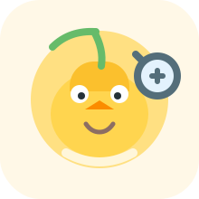

# LearnLikeMe

<p align="center">
  
</p>

<p align="center">
  Turn real chat history into a personalized project-learning copilot with Codex.
</p>

<p align="center">
  用真实聊天记录，为自己生成一个个性化的项目学习副驾。
</p>

<p align="center">
  
  
  
</p>

LearnLikeMe is a Codex-friendly OpenAI Agent Skill package that turns local chat history into a reusable, personalized project-learning assistant.

LearnLikeMe 是一个面向 Codex 的 OpenAI Agent Skill 项目，目标是把本地聊天记录转成可复用、个性化的项目学习助手。

Instead of forcing everyone through the same generic tutor flow, LearnLikeMe treats chat history as the default evidence source, asks only the minimum necessary follow-up questions, and generates a runtime skill that teaches codebases in the learner's own style.

它不会默认先做完整问卷，而是优先从历史聊天记录中提炼偏好，只在证据不足、互相矛盾或低置信度时才补问。

## Why This Is Different | 为什么不一样

- History-first personalization, not questionnaire-first personalization
- Stable preferences and situational preferences are separated
- Generated outputs are written to local files, not only shown in chat
- The generated runtime skill is proactive, roadmap-driven, and Codex-friendly
- Privacy defaults to local-first: history and generated user-specific skills stay out of Git by default

- 先看历史聊天，再补问，而不是先做一整套问卷
- 区分稳定偏好和场景偏好
- 生成结果会落到本地文件，而不是只显示在聊天里
- 生成出的 runtime skill 是主动式、路线图驱动、适合 Codex 使用的
- 默认隐私优先：历史记录和用户专属生成结果默认不进 Git

## What You Get | 你会得到什么

- Builder skill: `learn-like-me`
- Generated runtime skill: `project-learning-assistant`
- Default generated skill path: `generated-skills/project-learning-assistant/`
- Default generated profile path: `generated-skills/learning-profile.md`
- History-first personalization from Markdown chat exports
- Fixed runtime output contract:
  - `project map`
  - `current understanding`
  - `hidden questions`
  - `next best step`

- builder skill：`learn-like-me`
- 生成出的 runtime skill：`project-learning-assistant`
- 默认 skill 输出目录：`generated-skills/project-learning-assistant/`
- 默认 learning profile 输出文件：`generated-skills/learning-profile.md`
- 基于 Markdown 历史聊天记录的个性化分析
- 固定的运行时输出合同：
  - `project map`
  - `current understanding`
  - `hidden questions`
  - `next best step`

## Default Workflow | 默认工作流

### 1. Clone the repository | 克隆仓库

```bash
git clone https://github.com/CHEN2003-CHIP/LearnLikeMe.git
cd LearnLikeMe
```

### 2. Put your materials into the input folder | 把材料放进输入目录

Drop exported Markdown chats into:

```text
learn-like-me-input/history/
```

Optional files:

- `learn-like-me-input/preferences.md`
- `learn-like-me-input/context.md`

把导出的 Markdown 聊天记录放到：

```text
learn-like-me-input/history/
```

可选补充：

- `learn-like-me-input/preferences.md`
- `learn-like-me-input/context.md`

### 3. Open the repo in Codex | 用 Codex 打开仓库

Make sure Codex can read:

- `learn-like-me/`
- `learn-like-me-input/history/`
- `learn-like-me-input/preferences.md`
- `learn-like-me-input/context.md`
- `generated-skills/`

确保 Codex 能读取：

- `learn-like-me/`
- `learn-like-me-input/history/`
- `learn-like-me-input/preferences.md`
- `learn-like-me-input/context.md`
- `generated-skills/`

### 4. Give Codex the starter prompt | 把启动提示词发给 Codex

Use [CODEX-STARTER-PROMPT.md](./CODEX-STARTER-PROMPT.md).

直接使用 [CODEX-STARTER-PROMPT.md](./CODEX-STARTER-PROMPT.md)。

### 5. Let Codex generate the profile and skill | 让 Codex 生成画像和 skill

Codex should:

1. read history first
2. infer preferences with confidence
3. ask only minimal follow-up questions
4. write the profile to `generated-skills/learning-profile.md`
5. write the runtime skill to `generated-skills/project-learning-assistant/`

Codex 应该：

1. 先读历史聊天
2. 带置信度地推断偏好
3. 只问最少的补充问题
4. 把画像写到 `generated-skills/learning-profile.md`
5. 把 runtime skill 写到 `generated-skills/project-learning-assistant/`

### 6. Use the generated runtime skill | 使用生成后的 runtime skill

After generation, tell Codex to use the generated skill directly, for example:

```text
Use generated-skills/project-learning-assistant to help me learn this repository.
Start with a project map, then guide me step by step.
```

生成后，直接这样让 Codex 使用它：

```text
请使用 generated-skills/project-learning-assistant 带我学习这个仓库。
先给我 project map，再一步一步讲。
```

## Output Contract | 输出合同

Every runtime response must end with:

- `project map`
- `current understanding`
- `hidden questions`
- `next best step`

每次 runtime skill 的回答都必须以这四个部分结尾：

- `project map`
- `current understanding`
- `hidden questions`
- `next best step`

## Repository Structure | 仓库结构

```text
.
|- learn-like-me/
|  |- SKILL.md
|  |- agents/
|  |- references/
|  `- assets/
|- learn-like-me-input/
|  |- history/
|  |- preferences.md
|  `- context.md
|- generated-skills/
|  `- project-learning-assistant/
|- CODEX-STARTER-PROMPT.md
`- skill.zip
```

## Privacy by Default | 默认隐私策略

User chat history under `learn-like-me-input/history/` stays local by default.

User-specific generated outputs under `generated-skills/` also stay local by default.

放在 `learn-like-me-input/history/` 下的用户聊天记录默认只用于本地分析。

放在 `generated-skills/` 下的用户专属生成结果也默认只保留在本地。

## Sample vs Generated Output | 示例产物与真实产物

The sample-generated skill under `learn-like-me/assets/sample-generated-skill/` is a reference artifact.

The active generated output should live under `generated-skills/`.

`learn-like-me/assets/sample-generated-skill/` 里的内容只是示例快照。

真正的本地生成结果应该写到 `generated-skills/`。

## Core Idea | 核心理念

The best project-learning assistant should not start from zero.

It should start from how you already learn.

最好的项目学习助手，不应该从零开始。

它应该从“你本来就是怎么学习的”开始。
